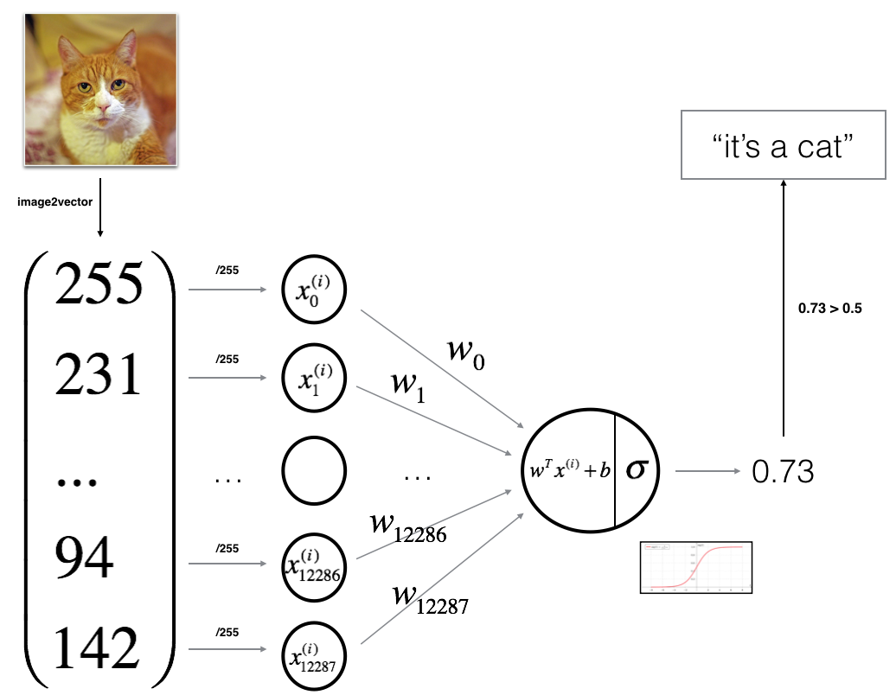
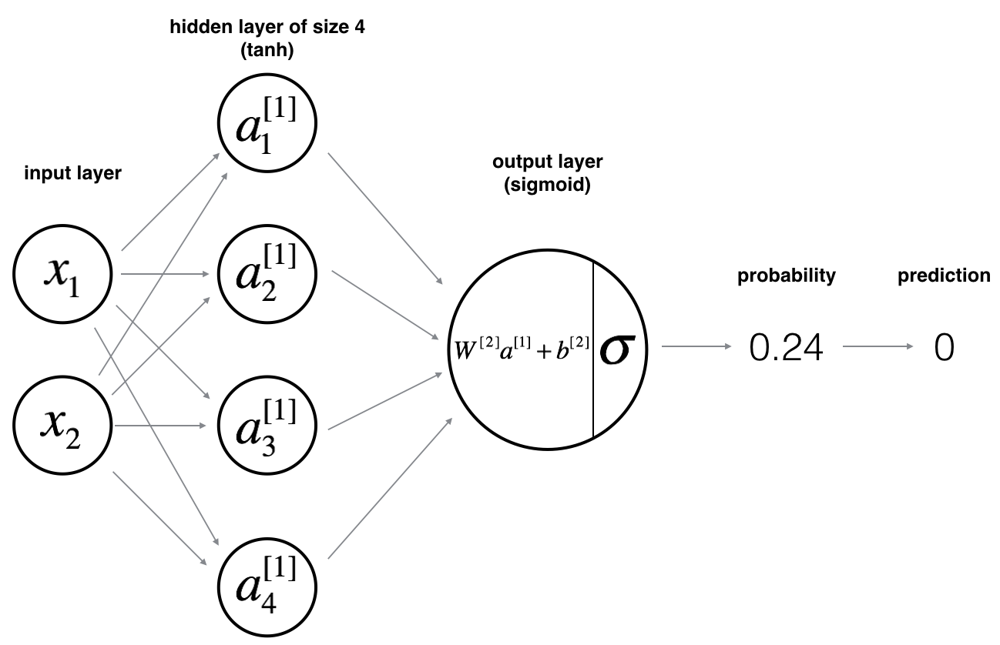
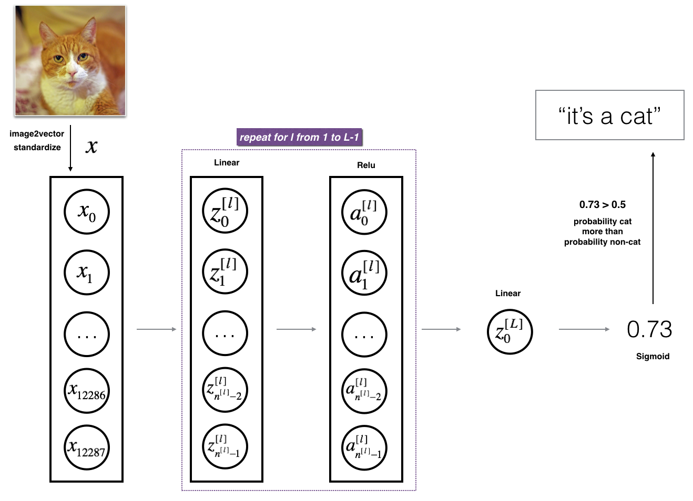

# Neural Networks and Deep Learning — Course 1
### Deep Learning Specialization by Andrew Ng — DeepLearning.AI & Coursera

[](https://www.coursera.org/specializations/deep-learning)
[](https://www.deeplearning.ai/)
[](https://www.python.org/)
[](https://numpy.org/)
[](#)
[](#)
[](../LICENSE)

---

## 📌 Overview

This repository contains completed programming assignments and implementations for **Course 1: Neural Networks and Deep Learning** from the **Deep Learning Specialization** by **Dr. Andrew Ng** ([DeepLearning.AI](https://www.deeplearning.ai/) / Coursera).

All models and optimization routines are built **from scratch using pure Python and NumPy** without high-level frameworks like TensorFlow or PyTorch. The progression moves from vectorization basics to a shallow neural network, and culminates in a modular **L-layer Deep Neural Network Cat Classifier** achieving **80% test accuracy**.

---

## 🗺️ Course Curriculum & Progression

| Week | Focus | Assignment | Key Topics & Models | Test Acc |
|:---:|:---|:---|:---|:---:|
| **Week 1** | Deep Learning Foundations | Conceptual Lectures | Neural network scale drivers (Data, Compute, Algorithms), ReLU benefits | — |
| **Week 2** | Basics & Vectorization | [`W2A1`](./W2A1/Python_Basics_with_Numpy.ipynb): Python Basics with NumPy<br>[`W2A2`](./W2A2/Logistic_Regression_with_a_Neural_Network_mindset.ipynb): Logistic Regression as a NN | NumPy vectorization, broadcasting, single-neuron Cat Classifier | **70.0%** |
| **Week 3** | Shallow Neural Networks | [`W3A1`](./W3A1/Planar_data_classification_with_one_hidden_layer.ipynb): Planar Data Classification | 2-layer NN, $\tanh$ hidden units, random init, non-linear boundaries | **90.0%** |
| **Week 4** | Deep Neural Networks | [`W4A1`](./W4A1/Building_your_Deep_Neural_Network_Step_by_Step.ipynb): Modular Deep NN Engine<br>[`W4A2`](./W4A2/Deep%20Neural%20Network%20-%20Application.ipynb): Deep NN Image Classification | Reusable $L$-layer forward/backward engine, 2-layer vs. 4-layer Deep NN | **80.0%** |

---

## 🔬 Assignments & Implementation Details

### 🔹 Week 2: Vectorization & Logistic Regression

#### 1. Python Basics with NumPy (`W2A1`)
* **Notebook**: [`Python_Basics_with_Numpy.ipynb`](./W2A1/Python_Basics_with_Numpy.ipynb)
* **Goal**: Build core mathematical routines using vectorized NumPy operations.
* **Implemented Functions**:
  - `sigmoid(x)` & `sigmoid_derivative(x)`: Element-wise sigmoid and its analytical gradient $\sigma'(x) = \sigma(x)(1 - \sigma(x))$.
  - `image2vector(image)`: Reshaping 3D images $(H, W, C) \to (H \cdot W \cdot C, 1)$ without loops.
  - `normalize_rows(x)`: Normalizing rows using L2 norm $\|x\|_2$ to stabilize numerical gradients.
  - `softmax(x)`: Numerically stable row-wise softmax for multi-class probability outputs.
  - `L1(yhat, y)` & `L2(yhat, y)`: Vectorized implementations of absolute and squared error loss.

---

#### 2. Logistic Regression with a Neural Network Mindset (`W2A2`)
* **Notebook**: [`Logistic_Regression_with_a_Neural_Network_mindset.ipynb`](./W2A2/Logistic_Regression_with_a_Neural_Network_mindset.ipynb)
* **Goal**: Train a single-neuron logistic regression model to classify images as **Cat ($y=1$)** or **Non-Cat ($y=0$)**.



* **Dataset**:
  - $m_{train} = 209$ images, $m_{test} = 50$ images ($64 \times 64 \times 3$ RGB).
  - Flattened input: $n_x = 12,288$ features, normalized to $[0, 1]$ by dividing by 255.
* **Algorithm Flow**:
  - **Forward**: $Z = w^T X + b$, $A = \sigma(Z)$, $J = -\frac{1}{m} \sum [Y \log A + (1 - Y) \log(1 - A)]$.
  - **Backward**: $dw = \frac{1}{m} X(A - Y)^T$, $db = \frac{1}{m} \sum (A - Y)$.
  - **Optimization**: Gradient descent update $w := w - \alpha \, dw$, $b := b - \alpha \, db$.
* **Results**:
  - 2,000 iterations ($\alpha = 0.005$) $\to$ **Train: 99.04%** | **Test: 70.0%**.
  - *Takeaway*: A single linear neuron easily fits training data but lacks non-linear representation capacity, capping test accuracy at 70%.

---

### 🔹 Week 3: Shallow Neural Networks (One Hidden Layer)

#### Planar Data Classification (`W3A1`)
* **Notebook**: [`Planar_data_classification_with_one_hidden_layer.ipynb`](./W3A1/Planar_data_classification_with_one_hidden_layer.ipynb)
* **Goal**: Classify a non-linearly separable 2D "flower" dataset using a 2-layer neural network.



* **Architecture**:
  - Input layer: $n_x = 2$ features.
  - Hidden layer: $n_h = 4$ units with $\tanh$ activation ($Z^{[1]} = W^{[1]}X + b^{[1]}$, $A^{[1]} = \tanh(Z^{[1]})$).
  - Output layer: $n_y = 1$ unit with Sigmoid activation ($A^{[2]} = \sigma(W^{[2]}A^{[1]} + b^{[2]})$).
* **Key Implementations**:
  - **Symmetry Breaking**: Initialized weights randomly (`np.random.randn(...) * 0.01`) to prevent identical neuron gradients.
  - **Backpropagation**: Derived chain rule using $\tanh'(z) = 1 - \tanh^2(z)$:
    $$dZ^{[2]} = A^{[2]} - Y, \quad dZ^{[1]} = (W^{[2]})^T dZ^{[2]} * (1 - (A^{[1]})^2)$$
* **Results & Capacity Study**:
  - Logistic Regression baseline: **47.0%** (unable to capture non-linear decision boundary).
  - **2-Layer Neural Network ($n_h=4$)**: **90.0% accuracy** ($\alpha = 1.2$, 10,000 iterations).
  - Hidden layer size tuning ($n_h \in [1 \dots 50]$): Accuracy peaks at $n_h = 4, 5$ ($\sim 90.5\%-91.25\%$). Larger sizes ($n_h=50$) start overfitting noise.
  - Tested on other datasets: Noisy Moons (**97.0%**), Gaussian Quantiles (**100%**), Blobs (**83%**).

---

### 🔹 Week 4: Deep Neural Networks (L-Layer Architecture)

#### 1. Building Your Deep Neural Network: Step by Step (`W4A1`)
* **Notebook**: [`Building_your_Deep_Neural_Network_Step_by_Step.ipynb`](./W4A1/Building_your_Deep_Neural_Network_Step_by_Step.ipynb)
* **Goal**: Build a fully vectorized, modular $L$-layer deep neural network library with cached activations.


* **Modular Components**:
  1. **Deep Initialization**: `initialize_parameters_deep(layer_dims)` with scaled random weights ($W^{[l]} \sim \mathcal{N}(0, 1)/\sqrt{n^{[l-1]}}$).
  2. **Forward Modules**:
     - `linear_forward(A, W, b)`: Computes $Z^{[l]} = W^{[l]}A^{[l-1]} + b^{[l]}$ and caches $(A^{[l-1]}, W^{[l]}, b^{[l]})$.
     - `linear_activation_forward(...)`: Linear step followed by $\text{ReLU}$ (hidden layers) or $\text{Sigmoid}$ (output layer).
     - `L_model_forward(X, parameters)`: Full forward propagation loop returning $A^{[L]}$ and layer caches.
  3. **Cost**: `compute_cost(AL, Y)` evaluating cross-entropy loss.
  4. **Backward Modules**:
     - `linear_backward(dZ, cache)`: Computes $dW^{[l]}, db^{[l]}, dA^{[l-1]}$.
     - `linear_activation_backward(...)`: Backpropagates through activation derivatives (`relu_backward` & `sigmoid_backward`).
     - `L_model_backward(AL, Y, caches)`: Full backpass from layer $L$ to layer 1.
  5. **Parameter Update**: `update_parameters(parameters, grads, learning_rate)` with gradient descent.

---

#### 2. Deep Neural Network for Image Classification: Application (`W4A2`)
* **Notebook**: [`Deep Neural Network - Application.ipynb`](./W4A2/Deep%20Neural%20Network%20-%20Application.ipynb)
* **Goal**: Benchmark the Cat vs. Non-Cat dataset using a 2-layer network vs. a 4-layer deep neural network.



* **Models Evaluated**:
  - **2-Layer Model**: `[12288, 7, 1]` $\to$ $\text{ReLU} \to \text{Sigmoid}$.
    - Iterations: 2,500 | $\alpha = 0.0075$
    - Train Acc: **100.0%** | **Test Acc: 72.0%**
  - **4-Layer Deep Model**: `[12288, 20, 7, 5, 1]` $\to$ $[\text{Linear} \to \text{ReLU}] \times 3 \to \text{Linear} \to \text{Sigmoid}$ ($\approx 246\text{k}$ parameters).
    - Iterations: 2,500 | $\alpha = 0.0075$
    - Train Acc: **98.56%** | **Test Acc: 80.0%**
* **Key Finding**: The 4-layer network achieves an **$+8.0\%$ accuracy improvement** over the 2-layer model and **$+10.0\%$ over logistic regression**. Hierarchical feature representations (edges $\to$ textures $\to$ facial features $\to$ cat detector) yield substantially better generalization.

---

## 📊 Performance Benchmark

| Model | Architecture | Iterations | Learning Rate ($\alpha$) | Train Accuracy | Test Accuracy |
|:---|:---|:---:|:---:|:---:|:---:|
| **Logistic Regression** (W2A2) | `[12288, 1]` | 2,000 | 0.0050 | 99.04% | **70.0%** |
| **2-Layer Neural Network** (W4A2) | `[12288, 7, 1]` | 2,500 | 0.0075 | 100.0% | **72.0%** |
| **4-Layer Deep Neural Network** (W4A2) | **`[12288, 20, 7, 5, 1]`** | **2,500** | **0.0075** | **98.56%** | **80.0%** |

---

## 📐 Dimensions & Activations Cheatsheet

### Tensor Shapes (Batch size $m$):
| Variable | Shape | Description |
|:---|:---:|:---|
| $X$ | $(n^{[0]}, m)$ | Input feature matrix ($n^{[0]} = 12288$) |
| $W^{[l]}$ | $(n^{[l]}, n^{[l-1]})$ | Weight matrix for layer $l$ |
| $b^{[l]}$ | $(n^{[l]}, 1)$ | Bias vector for layer $l$ |
| $Z^{[l]}, A^{[l]}$ | $(n^{[l]}, m)$ | Linear score and post-activation output |
| $dW^{[l]}$ | $(n^{[l]}, n^{[l-1]})$ | Gradient of cost with respect to $W^{[l]}$ |
| $db^{[l]}$ | $(n^{[l]}, 1)$ | Gradient of cost with respect to $b^{[l]}$ |

### Activation Functions:
* **ReLU**: $g(z) = \max(0, z)$ | $g'(z) = 1$ if $z > 0$ else $0$ *(Used in hidden layers to eliminate vanishing gradients)*.
* **Tanh**: $g(z) = \frac{e^z - e^{-z}}{e^z + e^{-z}}$ | $g'(z) = 1 - g(z)^2$ *(Zero-centered activation for shallow hidden layers)*.
* **Sigmoid**: $\sigma(z) = \frac{1}{1 + e^{-z}}$ | $\sigma'(z) = \sigma(z)(1 - \sigma(z))$ *(Used in output layer for binary probability)*.

---

## 📁 Repository Structure

```text
Course1-Neural-Networks-and-Deep-Learning/
├── README.md                                             # Course 1 Documentation
├── W2A1/                                                 # Week 2 - Assignment 1
│   ├── Python_Basics_with_Numpy.ipynb                    # Vectorization & NumPy routines
│   ├── public_tests.py                                   # Unit tests
│   └── test_utils.py                                     # Assertion helpers
├── W2A2/                                                 # Week 2 - Assignment 2
│   ├── Logistic_Regression_with_a_Neural_Network_mindset.ipynb  # Single-Neuron Cat Classifier
│   ├── datasets/                                         # HDF5 Cat vs. Non-Cat datasets
│   ├── images/                                           # Architecture diagrams & test photos
│   ├── lr_utils.py                                       # Dataset loader
│   └── public_tests.py                                   # Unit tests
├── W3A1/                                                 # Week 3 - Assignment 1
│   ├── Planar_data_classification_with_one_hidden_layer.ipynb  # 2-Layer Planar Classifier
│   ├── planar_utils.py                                   # Decision boundary plotting utilities
│   ├── testCases_v2.py & public_tests.py                 # Test cases & autograder checks
│   └── test_utils.py                                     # Unit testing runner
├── W4A1/                                                 # Week 4 - Assignment 1
│   ├── Building_your_Deep_Neural_Network_Step_by_Step.ipynb  # Modular L-Layer DNN Engine
│   ├── dnn_utils.py                                      # Activation & backward primitives
│   ├── testCases.py                                      # Pre-computed test matrices
│   └── public_tests.py                                   # Autograder test cases
└── W4A2/                                                 # Week 4 - Assignment 2
    ├── Deep Neural Network - Application.ipynb           # 2-Layer vs 4-Layer Cat Classifier
    ├── datasets/                                         # Image datasets
    ├── dnn_app_utils_v3.py                               # Helper functions
    └── public_tests.py                                   # Autograder test cases
```

---

## 🚀 Quickstart & Execution

1. **Install dependencies**:
   ```bash
   pip install numpy matplotlib h5py scipy Pillow
   ```
2. **Launch Jupyter**:
   ```bash
   jupyter notebook
   ```
3. Open any assignment notebook (e.g., [`W4A2/Deep Neural Network - Application.ipynb`](./W4A2/Deep%20Neural%20Network%20-%20Application.ipynb)) and run all cells. All public tests and model training routines execute cleanly.

---

## 🎓 Acknowledgements

* **Instructor**: Dr. Andrew Ng
* **Platform**: [DeepLearning.AI](https://www.deeplearning.ai/) & [Coursera](https://www.coursera.org/)
* **Course**: [Neural Networks and Deep Learning](https://www.coursera.org/learn/neural-networks-deep-learning)
