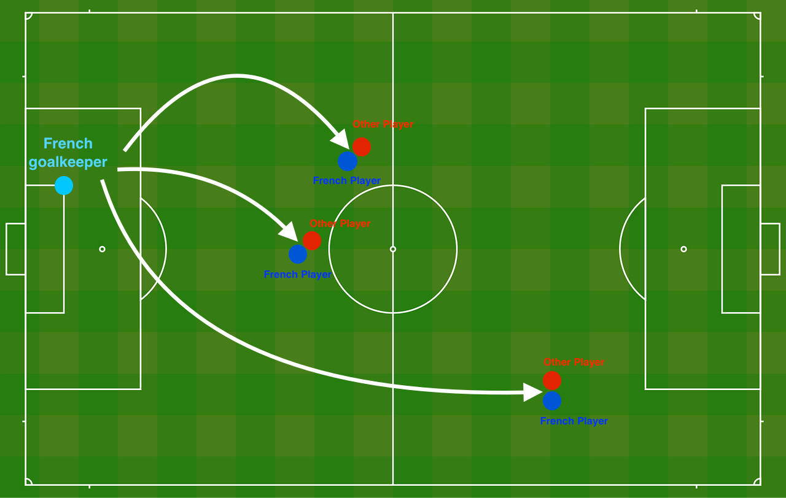
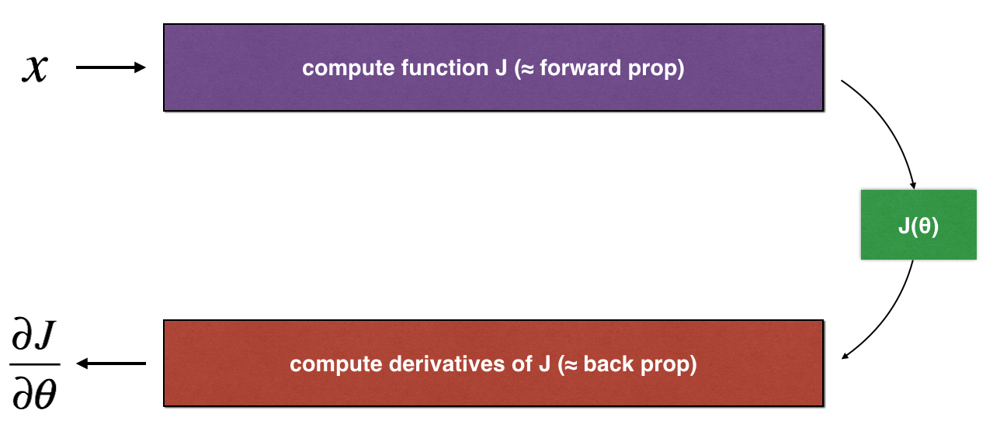
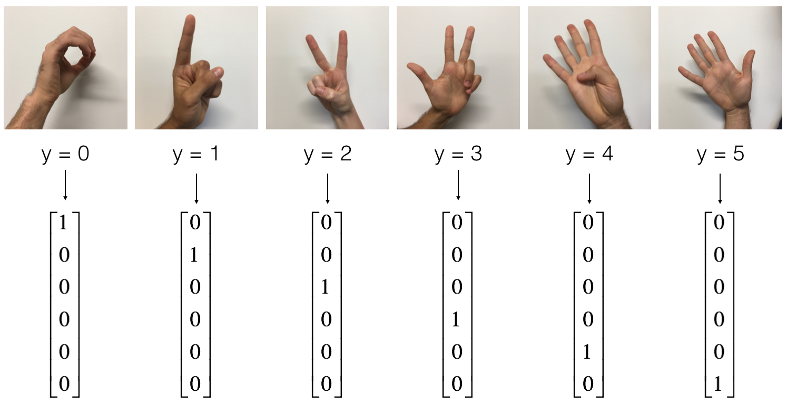

# Improving Deep Neural Networks: Hyperparameter Tuning, Regularization and Optimization — Course 2
### Deep Learning Specialization by Andrew Ng — DeepLearning.AI & Coursera

[](https://www.coursera.org/specializations/deep-learning)
[](https://www.deeplearning.ai/)
[](https://www.python.org/)
[](https://numpy.org/)
[](https://www.tensorflow.org/)
[](#)
[](#)
[](../LICENSE)

---

## 📌 Overview

This repository contains completed programming assignments, rigorous mathematical implementations, and benchmarking experiments for **Course 2: Improving Deep Neural Networks: Hyperparameter Tuning, Regularization and Optimization** from the **Deep Learning Specialization** taught by **Dr. Andrew Ng** ([DeepLearning.AI](https://www.deeplearning.ai/) / Coursera).

While Course 1 laid the mathematical foundations of forward and backward propagation from scratch, Course 2 focuses on turning deep networks into robust, production-grade models:
1. **Weight Initialization**: Analyzing why zero and large random initializations fail and implementing **He initialization** to preserve activation variances.
2. **Regularization Techniques**: Mitigating overfitting using **$L_2$ Regularization (Weight Decay)** and **Inverted Dropout** to boost test accuracy on noisy datasets.
3. **Numerical Verification**: Writing custom **Gradient Checking ($1\text{D}$ & $N\text{D}$)** algorithms to ensure analytical backprop precision within $\varepsilon < 10^{-7}$.
4. **Advanced Optimization**: Implementing first-order optimization algorithms from scratch — **Mini-Batch Gradient Descent**, **Momentum**, and **Adam (Adaptive Moment Estimation)** — paired with **Learning Rate Decay schedules**.
5. **Modern Deep Learning Frameworks**: Transitioning from pure NumPy to **TensorFlow 2.x**, leveraging `tf.GradientTape`, high-performance `tf.data` streaming pipelines, and custom training loops on multi-class hand gesture recognition (**SIGNS Dataset**).

---

## 🗺️ Course Curriculum & Progression

| Week | Focus | Assignment | Key Topics & Algorithms | Benchmark Metric |
|:---:|:---|:---|:---|:---:|
| **Week 1** | Practical Aspects of DL | [`W1A1`](./Week1/W1A1/Initialization.ipynb): Initialization<br>[`W1A2`](./Week1/W1A2/Regularization.ipynb): Regularization<br>[`W1A3`](./Week1/W1A3/Gradient_Checking.ipynb): Gradient Checking | • Zero vs. Random vs. He Initialization<br>• $L_2$ Weight Decay & Inverted Dropout<br>• Finite Difference Backprop Verification | **96.0%** Test Acc (He Init)<br>**95.0%** Test Acc (Dropout)<br>Diff $\approx 7.8 \times 10^{-11}$ |
| **Week 2** | Optimization Algorithms | [`W2A1`](./Week2/W2A1/Optimization_methods.ipynb): Optimization Methods | • Mini-batch Shuffling & Partitioning<br>• Velocity & Exponentially Weighted Averages<br>• Adam Optimizer & Learning Rate Decay | **95.3%** Accuracy (Momentum + Decay)<br>**94.3%** Rapid Convergence (Adam) |
| **Week 3** | Intro to TensorFlow | [`W3A1`](./Week3/W3A1/Tensorflow_introduction.ipynb): TensorFlow Introduction | • TF 2.x Eager Execution & `tf.GradientTape`<br>• `tf.data.Dataset` Streaming & Prefetching<br>• Multi-class Dense NN (6-class SIGNS) | **69.2%** Test Acc (Dense Baseline)<br>Loss reduced $1.83 \to 0.74$ |

---

## 🔬 Assignments & Implementation Details

### 🔹 Week 1: Practical Aspects of Deep Learning

#### 1. Initialization (`Week1/W1A1`)
* **Notebook**: [`Initialization.ipynb`](./Week1/W1A1/Initialization.ipynb)
* **Goal**: Solve the vanishing/exploding gradients problem on a 3-layer neural network (`[2, 10, 5, 1]`) evaluated on a 2D planar classification dataset.
* **Comparative Implementations**:
  1. **Zero Initialization** (`zeros`):
     - $W^{[l]} = 0, \quad b^{[l]} = 0$.
     - *Flaw*: Fails to break symmetry. Every neuron in layer $l$ computes identical activations ($a^{[l]} = g(0)$) and receives identical gradients during backpropagation. The network behaves as a simple linear classifier.
     - *Result*: **Train: 50.0%** | **Test: 50.0%** | Cost remains flat at $0.693$.
  2. **Large Random Initialization** (`random`):
     - $W^{[l]} \sim \mathcal{N}(0, 1) \times 10$.
     - *Flaw*: Produces excessively large inputs $z^{[l]}$, causing $\tanh$ and sigmoid activations to saturate. Gradients vanish ($g'(z) \approx 0$), leading to erratic initial costs (`inf`) and slow learning.
     - *Result*: **Train: 83.0%** | **Test: 86.0%**.
  3. **He Initialization** (`he` - He et al., 2015):
     - $W^{[l]} \sim \mathcal{N}(0, 1) \times \sqrt{\frac{2}{n^{[l-1]}}}$.
     - *Advantage*: Calibrated specifically for $\text{ReLU}$ activation functions. Preserves variance of activations across forward passes and gradients across backward passes, avoiding vanishing/exploding gradients.
     - *Result*: **Train: 99.3%** | **Test: 96.0%** (Fastest convergence, cleanest decision boundary).

---

#### 2. Regularization (`Week1/W1A2`)
* **Notebook**: [`Regularization.ipynb`](./Week1/W1A2/Regularization.ipynb)
* **Goal**: Eliminate high variance (overfitting) on a 2D French Football field dataset (`[2, 20, 3, 1]` architecture) where a goalkeeper's passing positions must be classified.



* **Evaluated Techniques**:
  1. **Baseline (Non-regularized)**:
     - Standard cross-entropy loss without penalties.
     - *Result*: **Train: 94.8%** | **Test: 91.5%** — Overfits noisy training samples, producing fragmented decision boundaries.
  2. **$L_2$ Regularization (Frobenius Norm / Weight Decay)**:
     - Penalizes large weight values in the cost function:
       $$\mathcal{J}_{reg} = \mathcal{J} + \frac{\lambda}{2m} \sum_{l=1}^{L} \|W^{[l]}\|_F^2 = \mathcal{J} + \frac{\lambda}{2m} \sum_{l=1}^{L} \sum_{i} \sum_{j} (W_{i,j}^{[l]})^2$$
     - Analytical gradient adjustment:
       $$dW^{[l]} = dW^{[l]}_{orig} + \frac{\lambda}{m} W^{[l]}$$
     - *Result*: **Train: 93.8%** | **Test: 93.0%** ($\lambda = 0.7$). Smooths the boundary and prevents any single feature from dominating.
  3. **Inverted Dropout**:
     - Randomly deactivates neurons during forward propagation with probability $(1 - \text{keep\_prob})$.
     - Forward mask & scaling:
       $$D^{[l]} = (\text{random} < \text{keep\_prob}), \quad A^{[l]} = \frac{A^{[l]} * D^{[l]}}{\text{keep\_prob}}$$
       *Note: Dividing by $\text{keep\_prob}$ preserves the expected value $\mathbb{E}[A^{[l]}]$ during training, eliminating the need to rescale weights at test time.*
     - Backpropagation mask:
       $$dA^{[l]} = \frac{dA^{[l]} * D^{[l]}}{\text{keep\_prob}}$$
     - *Result*: **Train: 92.9%** | **Test: 95.0%** ($\text{keep\_prob} = 0.86$). Highest generalization score on unseen data.

---

#### 3. Gradient Checking (`Week1/W1A3`)
* **Notebook**: [`Gradient_Checking.ipynb`](./Week1/W1A3/Gradient_Checking.ipynb)
* **Goal**: Numerically verify analytical backpropagation gradients using finite two-sided differences.



* **Formulation**:
  $$\text{gradapprox}[i] = \frac{\mathcal{J}(\theta_1, \dots, \theta_i + \varepsilon, \dots) - \mathcal{J}(\theta_1, \dots, \theta_i - \varepsilon, \dots)}{2 \varepsilon}$$
  $$\text{difference} = \frac{\|\text{grad} - \text{gradapprox}\|_2}{\|\text{grad}\|_2 + \|\text{gradapprox}\|_2}$$
* **Key Steps**:
  - Reshaped and unrolled all parameter matrices $\{W^{[1]}, b^{[1]}, \dots, W^{[L]}, b^{[L]}\}$ into a single 1D vector $\theta$ via `dictionary_to_vector`.
  - **1D Verification**: Validated on single-variable model with $\varepsilon = 10^{-7} \implies \text{difference} \approx 7.81 \times 10^{-11} < 10^{-7}$ (Confirmed analytical correctness).
  - **N-D Verification**: Unrolled deep network parameters and used gradient checking to catch intentionally seeded bugs in backpropagation (flagged difference of $0.285 > 10^{-7}$).
  - *Engineering Note*: Gradient checking is computationally expensive ($\mathcal{O}(2 \times \text{num\_params})$ forward passes) and is used strictly for unit testing and debugging, never during training.

---

### 🔹 Week 2: Optimization Algorithms

#### Optimization Methods (`Week2/W2A1`)
* **Notebook**: [`Optimization_methods.ipynb`](./Week2/W2A1/Optimization_methods.ipynb)
* **Goal**: Implement, benchmark, and compare advanced first-order optimization algorithms on a non-linearly separable "noisy moons" dataset.


* **Implemented Optimizers**:
  1. **Mini-Batch Gradient Descent**:
     - Implemented `random_mini_batches(X, Y, mini_batch_size)`:
       1. **Shuffle**: Synchronously permutes $(X, Y)$ along columns.
       2. **Partition**: Splits data into chunks of size $64$, handling the final remainder batch $(\text{size} < 64)$.
     - Significantly speeds up training compared to Batch GD on large datasets.
  2. **Gradient Descent with Momentum**:
     - Computes an exponentially weighted average of past gradients to dampen orthogonal oscillations:
       $$v_{dW^{[l]}} = \beta \, v_{dW^{[l]}} + (1 - \beta) \, dW^{[l]}$$
       $$v_{db^{[l]}} = \beta \, v_{db^{[l]}} + (1 - \beta) \, db^{[l]}$$
       $$W^{[l]} := W^{[l]} - \alpha \, v_{dW^{[l]}}, \quad b^{[l]} := b^{[l]} - \alpha \, v_{db^{[l]}}$$
     - Hyperparameter $\beta = 0.9$ (averaging over roughly $\approx \frac{1}{1-\beta} = 10$ past steps).
  3. **Adam (Adaptive Moment Estimation)**:
     - Unifies **Momentum** (first moment vector $v$) and **RMSprop** (second raw moment vector $s$) with bias correction:
       $$v_{dW^{[l]}} = \beta_1 v_{dW^{[l]}} + (1 - \beta_1) dW^{[l]}, \quad s_{dW^{[l]}} = \beta_2 s_{dW^{[l]}} + (1 - \beta_2) (dW^{[l]})^2$$
       $$v^{\text{corrected}}_{dW^{[l]}} = \frac{v_{dW^{[l]}}}{1 - (\beta_1)^t}, \quad s^{\text{corrected}}_{dW^{[l]}} = \frac{s_{dW^{[l]}}}{1 - (\beta_2)^t}$$
       $$W^{[l]} := W^{[l]} - \alpha \frac{v^{\text{corrected}}_{dW^{[l]}}}{\sqrt{s^{\text{corrected}}_{dW^{[l]}}} + \varepsilon}$$
     - Hyperparameters: $\beta_1 = 0.9, \beta_2 = 0.999, \varepsilon = 10^{-8}$.
  4. **Learning Rate Decay & Scheduling**:
     - Iteration-based decay: $\alpha = \frac{1}{1 + \text{decay\_rate} \times \text{epoch\_num}} \alpha_0$.
     - Fixed interval schedule: Decay $\alpha$ every $K$ epochs by a fixed factor.
     - Prevents oscillation around the minimum, allowing models to settle into sharper loss basins.

---

### 🔹 Week 3: Introduction to TensorFlow

#### TensorFlow Introduction (`Week3/W3A1`)
* **Notebook**: [`Tensorflow_introduction.ipynb`](./Week3/W3A1/Tensorflow_introduction.ipynb)
* **Goal**: Build a multi-class deep neural network using **TensorFlow 2.x** with eager execution, `tf.GradientTape`, and `tf.data.Dataset` on the **SIGNS dataset**.



* **Dataset Profile**:
  - Multi-class image classification: Hands signing numbers from **0 to 5** ($C = 6$ classes).
  - Train set: 1,080 images ($64 \times 64 \times 3$), Test set: 120 images ($64 \times 64 \times 3$).
  - Flattened feature dimension: $n_x = 64 \times 64 \times 3 = 12,288$.
* **Key Implementations**:
  1. **TensorFlow Primitives**:
     - `linear_function`: Vectorized tensor multiplication and broadcasting via `tf.matmul(X, W) + b`.
     - `one_hot_matrix`: Vectorized conversion of class labels to one-hot tensors via `tf.one_hot(labels, depth=6, axis=0)`.
  2. **High-Performance Data Pipeline (`tf.data`)**:
     - Built data loaders using `tf.data.Dataset.from_tensor_slices`.
     - Applied parallel preprocessing (`.map(normalize)`), batching (`.batch(32)`), and streaming memory caching (`.prefetch(8)`) to eliminate I/O bottlenecks.
  3. **Network Architecture**:
     - Layer 1: Dense $(12,288 \to 128)$, $\text{ReLU}$, HeNormal initialization.
     - Layer 2: Dense $(128 \to 64)$, $\text{ReLU}$, HeNormal initialization.
     - Output Layer: Dense $(64 \to 6)$, Linear logits output.
  4. **Custom Training Loop with `tf.GradientTape`**:
     - Loss: Categorical Crossentropy from logits (`tf.keras.losses.categorical_crossentropy(from_logits=True)`).
     - Optimizer: Adam (`learning_rate=0.0001`).
     - Automatic differentiation:
       ```python
       with tf.GradientTape() as tape:
           Z3 = forward_propagation(X_batch, parameters)
           loss = compute_total_loss(Z3, Y_batch)
       gradients = tape.gradient(loss, parameters)
       optimizer.apply_gradients(zip(gradients, parameters))
       ```
  5. **Results**:
     - Cost reduced from $1.830 \to 0.744$ over 100 epochs.
     - Train Accuracy: **75.4%** | Test Accuracy: **69.2%** (demonstrating effective end-to-end learning with a flat MLP on raw image pixels before moving to ConvNets).

---

## 📊 Comprehensive Performance Benchmark

### 1. Initialization Benchmark (Week 1 — Planar Dataset)
| Initialization Method | Train Accuracy | Test Accuracy | Convergence / Behavior |
|:---|:---:|:---:|:---|
| **Zero Initialization** | 50.0% | 50.0% | Failed to break symmetry; loss stuck at $\ln(2) \approx 0.693$ |
| **Large Random ($W \times 10$)** | 83.0% | 86.0% | Activations saturated, initial cost exploded to $\infty$ |
| **He Initialization** | **99.3%** | **96.0%** | Optimal variance scaling; fast and smooth convergence |

### 2. Regularization Benchmark (Week 1 — Football Field Dataset)
| Regularization Method | Train Accuracy | Test Accuracy | Overfitting Mitigation |
|:---|:---:|:---:|:---|
| **Baseline (None)** | 94.8% | 91.5% | Severe overfitting to training noise |
| **$L_2$ Regularization ($\lambda=0.7$)** | 93.8% | 93.0% | Penalized large weights; smooth decision boundary |
| **Inverted Dropout ($p=0.86$)** | 92.9% | **95.0%** | Exceptional generalization; lowest variance |

### 3. Optimizer Benchmark (Week 2 — Noisy Moons Dataset)
| Optimization Algorithm | Learning Rate ($\alpha$) | LR Decay | Accuracy | Convergence Characteristics |
|:---|:---:|:---:|:---:|:---|
| **Mini-Batch Gradient Descent** | 0.0007 | None | 71.7% | High oscillation across steep ravine valleys |
| **Mini-Batch + Momentum** | 0.0007 | None | 71.7% | Dampened vertical oscillations |
| **Mini-Batch + Adam** | 0.0007 | None | **94.3%** | Rapid convergence due to adaptive step size |
| **GD with LR Decay** | 0.1000 | Exponential | **94.3%** | Gradual reduction in step size stabilizes convergence |
| **Momentum with LR Decay** | 0.1000 | Exponential | **95.3%** | Superior speed and generalization performance |
| **Adam with LR Decay** | 0.0100 | Exponential | **94.0%** | Robust, low final loss variance |

---

## 📐 Optimization & Regularization Cheatsheet

### 1. He Weight Initialization
$$W^{[l]} \sim \mathcal{N}\left(0, \, \sqrt{\frac{2}{n^{[l-1]}}}\right)$$
*Use for ReLU activations to maintain variance $\text{Var}(a^{[l]}) \approx \text{Var}(a^{[l-1]})$. For $\tanh$, use Xavier/Glorot: $\sqrt{1 / n^{[l-1]}}$.*

### 2. $L_2$ Regularization (Weight Decay)
$$\mathcal{J}_{\text{reg}} = \mathcal{J} + \frac{\lambda}{2m} \sum_{l=1}^L \|W^{[l]}\|_F^2, \qquad dW^{[l]} = dW^{[l]} + \frac{\lambda}{m} W^{[l]}$$
*Shrinks weights towards zero at each update step: $W := W\left(1 - \frac{\alpha \lambda}{m}\right) - \alpha \, dW$.*

### 3. Inverted Dropout
$$D^{[l]} = \text{Bernoulli}(\text{keep\_prob}), \qquad A^{[l]} = \frac{A^{[l]} \odot D^{[l]}}{\text{keep\_prob}}$$
*Scale during training so that test-time evaluation requires no modifications: $A^{[l]}_{\text{test}} = g(Z^{[l]})$.*

### 4. Adam Optimizer Updates
$$v_t = \beta_1 v_{t-1} + (1 - \beta_1) g_t, \qquad s_t = \beta_2 s_{t-1} + (1 - \beta_2) g_t^2$$
$$\hat{v}_t = \frac{v_t}{1 - \beta_1^t}, \qquad \hat{s}_t = \frac{s_t}{1 - \beta_2^t}$$
$$\theta_t = \theta_{t-1} - \frac{\alpha}{\sqrt{\hat{s}_t} + \varepsilon} \hat{v}_t$$

---

## 📁 Repository Structure

```text
Course2-Neural-Networks-and-Deep-Learning/
├── README.md                                             # Course 2 Documentation
├── Week1/                                                # Week 1: Practical Aspects of DL
│   ├── W1A1/                                             # Assignment 1: Weight Initialization
│   │   ├── Initialization.ipynb                          # Zero vs Random vs He Initialization
│   │   ├── init_utils.py                                 # Plotting and dataset helpers
│   │   └── public_tests.py                               # Unit test assertions
│   ├── W1A2/                                             # Assignment 2: Regularization
│   │   ├── Regularization.ipynb                          # L2 Regularization & Inverted Dropout
│   │   ├── datasets/                                     # Football field 2D dataset
│   │   ├── images/                                       # Football field problem diagrams
│   │   ├── reg_utils.py                                  # Forward & backward pass helpers
│   │   ├── testCases.py                                  # Test matrices
│   │   └── public_tests.py                               # Autograder unit tests
│   └── W1A3/                                             # Assignment 3: Gradient Checking
│       ├── Gradient_Checking.ipynb                       # 1D and N-D Gradient Checking
│       ├── gc_utils.py                                   # Dictionary to vector unrollers
│       ├── images/                                       # Finite difference diagrams
│       ├── testCases.py                                  # Test matrices
│       └── public_tests.py                               # Autograder assertions
├── Week2/                                                # Week 2: Optimization Algorithms
│   └── W2A1/                                             # Assignment 1: Optimization Methods
│       ├── Optimization_methods.ipynb                    # Mini-batch, Momentum, Adam, LR Decay
│       ├── datasets/                                     # Noisy moons 2D dataset
│       ├── images/                                       # Optimization trajectory animations
│       ├── opt_utils_v1a.py                              # Evaluation utilities & model runners
│       ├── testCases.py                                  # Test cases
│       └── public_tests.py                               # Autograder unit tests
└── Week3/                                                # Week 3: Introduction to TensorFlow
    └── W3A1/                                             # Assignment 1: TensorFlow Introduction
        ├── Tensorflow_introduction.ipynb                 # TF 2.x, GradientTape, SIGNS Classifier
        ├── datasets/                                     # SIGNS dataset (HDF5 train/test)
        ├── images/                                       # Hand sign diagrams & examples
        ├── improv_utils.py                               # Performance evaluation helpers
        ├── tf_utils.py                                   # Dataset loading & one-hot encoding
        ├── test_utils.py                                 # Shape verification helpers
        └── public_tests.py                               # Autograder unit tests
```

---

## 🚀 Quickstart & Execution

1. **Clone the repository and install required dependencies**:
   ```bash
   pip install numpy matplotlib h5py scipy Pillow tensorflow
   ```

2. **Launch Jupyter Notebook or JupyterLab**:
   ```bash
   jupyter notebook
   ```

3. **Run any notebook**:
   - Open any assignment, such as [`Week2/W2A1/Optimization_methods.ipynb`](./Week2/W2A1/Optimization_methods.ipynb) or [`Week3/W3A1/Tensorflow_introduction.ipynb`](./Week3/W3A1/Tensorflow_introduction.ipynb), and execute all cells sequentially. All unit tests and training routines run out-of-the-box.

---

## 🎓 Acknowledgements

* **Instructor**: Dr. Andrew Ng
* **Platform**: [DeepLearning.AI](https://www.deeplearning.ai/) & [Coursera](https://www.coursera.org/)
* **Specialization**: [Deep Learning Specialization](https://www.coursera.org/specializations/deep-learning)
* **Course**: [Improving Deep Neural Networks: Hyperparameter Tuning, Regularization and Optimization](https://www.coursera.org/learn/deep-neural-network)
